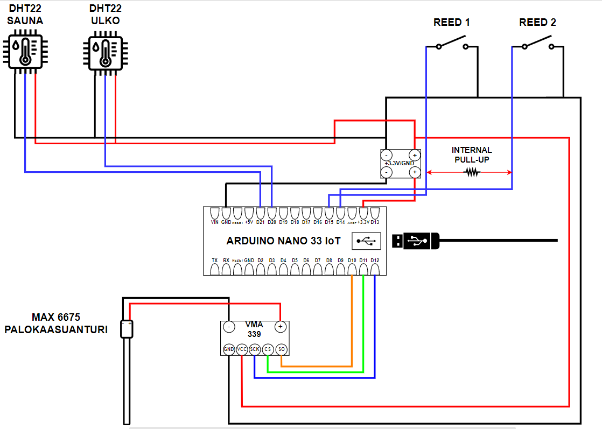
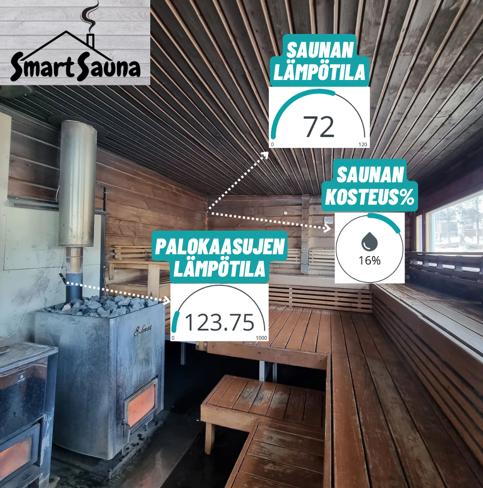
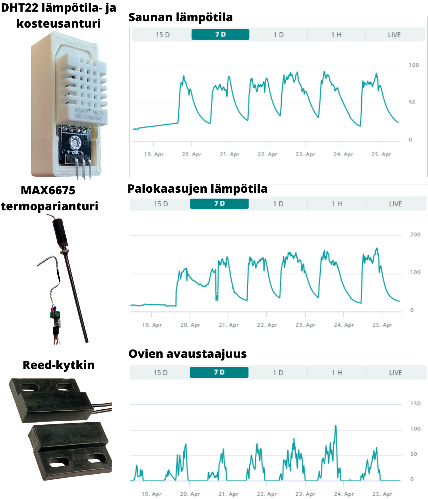

# SmartSauna

SmartSauna was developed as a part of a first year software development course at Oulu University of Applied Sciences along with two other students and in collaboration with the company [Koivurannan Saunalautta Oy](https://koivurannansaunalautta.fi/en/).

SmartSauna is an Arduino Nano 33 IoT based system that incorporates various sensors for monitoring the sauna and the surrounding environment in real time and an Arduino Cloud based web dashboard for visualizing the data.

It consists of the following sensors:
- 2x DHT22 temperature and humidity sensors, one for the sauna and one for the outside environment
- MAX6675 thermocouple sensor that measured the temperature of the sauna stove smoke.
- 2x Reed switches for monitoring the doors leading to the sauna and the sauna room

## Showcase

*Figure 1: A circuit diagram for the Arduino Nano 33 IoT and the sensors*

*Figure 2: The sauna view and location of the sensors*

*Figure 3: The dashboard view*
